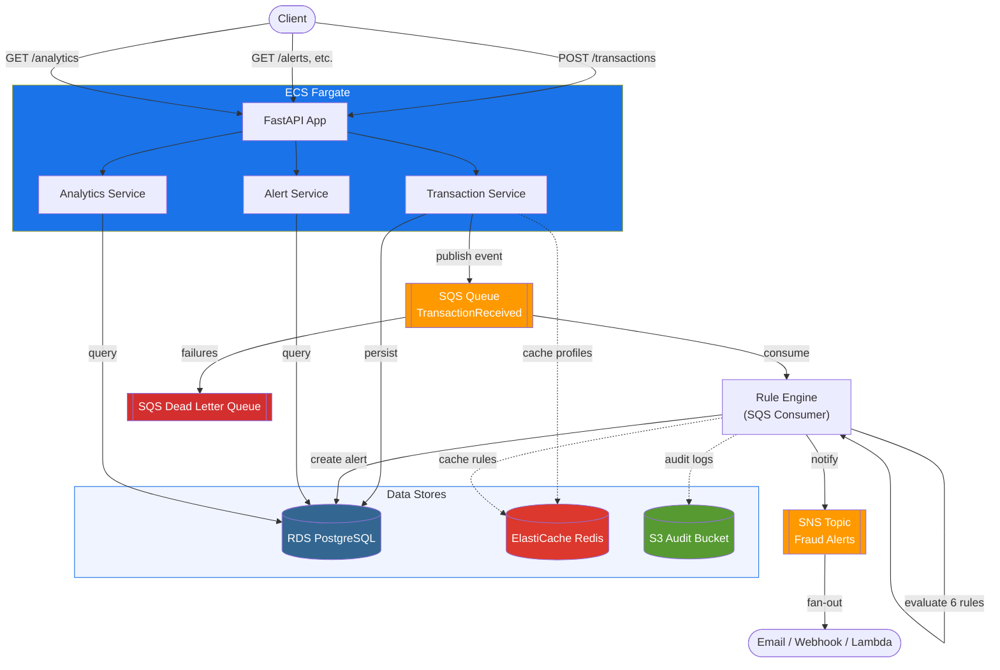
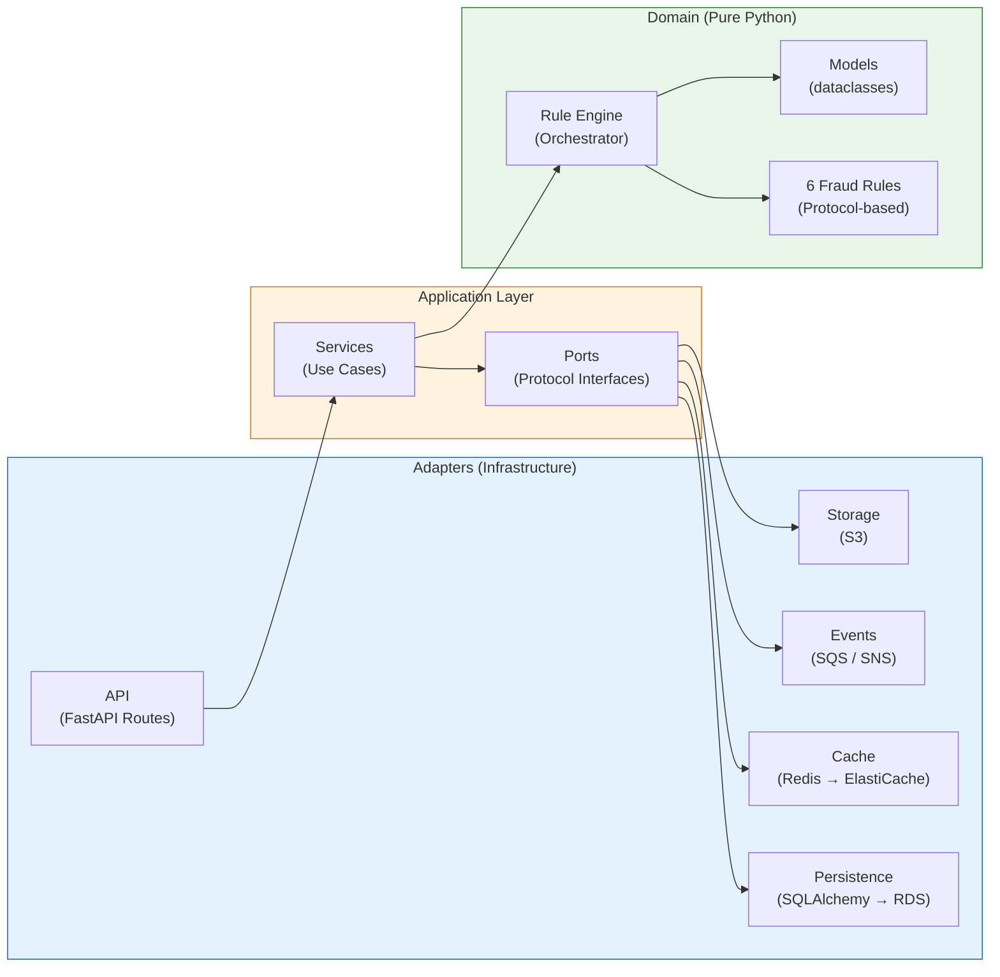
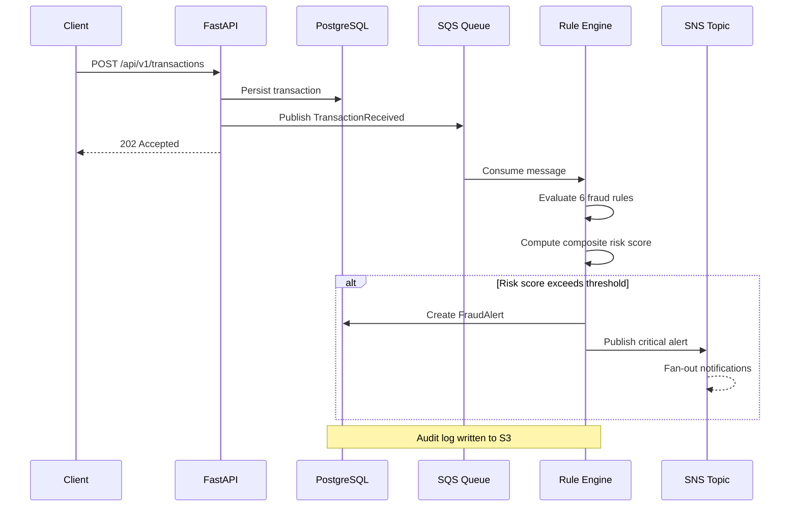

# Fraud Rule Engine Service

Real-time fraud detection service with configurable rules, event-driven architecture, and AWS-native infrastructure.

## Architecture

Modular monolith with hexagonal (clean) architecture — domain logic has zero framework imports.



### Hexagonal Architecture



### Event Flow



### AWS Services

| Service | Purpose |
|---------|---------|
| **RDS PostgreSQL 16** | Primary data store (transactions, alerts, rules, customer profiles) |
| **ElastiCache Redis 7** | Caching (customer profiles, rule configs), rate limiting |
| **SQS** | Async event bus for transaction processing (with dead-letter queue) |
| **SNS** | Fan-out notifications when fraud is detected |
| **S3** | Audit log storage, rule config snapshots |
| **ECS Fargate** | Container orchestration |
| **ECR** | Docker image registry |
| **CloudWatch** | Logs + metrics + alarms |

### Tech Stack

- **Python 3.12**, **FastAPI**, **SQLAlchemy 2.0** (async), **Pydantic v2**
- **uv** for dependency management
- **structlog** (JSON logging → CloudWatch), **OpenTelemetry** (tracing), **Prometheus** (metrics)
- **Alembic** for database migrations
- **Terraform** for infrastructure as code
- **Docker** multi-stage build, non-root user

## Fraud Detection Rules

| Rule | Logic | Default Parameters |
|------|-------|--------------------|
| **High Value** | Amount exceeds threshold | `threshold_zar: 50000` |
| **Velocity** | Too many txns in short window | `max_count: 5, window_minutes: 10` |
| **Geographic Anomaly** | Impossible travel (Haversine) | `max_speed_kmh: 900` |
| **Category Anomaly** | Unusual category for customer | Checks against `usual_categories` in profile |
| **Time Anomaly** | Transactions at unusual hours | `01:00-05:00 SAST` |
| **Cumulative Amount** | Daily spending exceeds limit | `daily_limit_zar: 100000` |

Rules are evaluated as a pipeline. Each produces a weighted score; the engine computes a **composite risk score** for full transparency and audit compliance.

## Quick Start

### Prerequisites

- Docker & Docker Compose
- uv (`curl -LsSf https://astral.sh/uv/install.sh | sh`)

### Local Development (Docker Compose)

```bash
# Clone and enter project
cd fraud-rule-engine

# Copy env file
cp .env.example .env

# Start all services (app + postgres + redis + localstack)
make docker-up

# Run migrations and seed data
make migrate
make seed

# Verify
curl http://localhost:8000/health
curl -H "X-API-Key: dev-api-key-change-me" http://localhost:8000/api/v1/rules
```

### Without Docker

```bash
# Install dependencies
make dev

# Start Postgres and Redis locally, then:
make migrate
make seed
make run
```

### Run Tests

```bash
make test          # All tests
make test-unit     # Unit tests only (no DB required)
make coverage      # With coverage report
```

## API Endpoints

All endpoints require `X-API-Key` header (except health checks).

### Transactions
| Method | Path | Description |
|--------|------|-------------|
| `POST` | `/api/v1/transactions` | Ingest transaction (`?sync=true` for immediate evaluation) |
| `GET` | `/api/v1/transactions` | List with filtering & pagination |
| `GET` | `/api/v1/transactions/{id}` | Detail with associated alerts |

### Rules (CRUD)
| Method | Path | Description |
|--------|------|-------------|
| `POST` | `/api/v1/rules` | Create rule |
| `GET` | `/api/v1/rules` | List all rules |
| `GET` | `/api/v1/rules/{id}` | Get rule |
| `PUT` | `/api/v1/rules/{id}` | Update rule |
| `DELETE` | `/api/v1/rules/{id}` | Delete rule |
| `POST` | `/api/v1/rules/{id}/test` | Dry-run against sample transaction |

### Alerts
| Method | Path | Description |
|--------|------|-------------|
| `GET` | `/api/v1/alerts` | List with filtering (status, severity, customer, date range) |
| `PATCH` | `/api/v1/alerts/{id}` | Update status (resolved, false_positive) |
| `GET` | `/api/v1/alerts/summary` | Counts by severity/status |

### Analytics
| Method | Path | Description |
|--------|------|-------------|
| `GET` | `/api/v1/analytics/overview` | Dashboard data |
| `GET` | `/api/v1/analytics/high-risk-customers` | Top N by risk score |

### Customers
| Method | Path | Description |
|--------|------|-------------|
| `GET` | `/api/v1/customers/{id}/profile` | Risk profile (cached in Redis) |
| `GET` | `/api/v1/customers/{id}/transactions` | Transaction history |
| `GET` | `/api/v1/customers/{id}/alerts` | Alert history |

### Health & Metrics
| Method | Path | Description |
|--------|------|-------------|
| `GET` | `/health` | Liveness check |
| `GET` | `/health/ready` | Readiness (DB + Redis) |
| `GET` | `/metrics` | Prometheus metrics |

All list endpoints support `?page=`, `?page_size=`, `?sort_by=`, `?order=`.

## Example: Detect Fraud

```bash
# 1. Create a high-value rule
curl -X POST http://localhost:8000/api/v1/rules \
  -H "X-API-Key: dev-api-key-change-me" \
  -H "Content-Type: application/json" \
  -d '{
    "name": "High Value Check",
    "rule_type": "high_value",
    "parameters": {"threshold_zar": 10000},
    "risk_weight": 1.0
  }'

# 2. Submit a suspicious transaction (sync mode)
curl -X POST "http://localhost:8000/api/v1/transactions?sync=true" \
  -H "X-API-Key: dev-api-key-change-me" \
  -H "Content-Type: application/json" \
  -d '{
    "customer_id": "CUST001",
    "amount": 75000.00,
    "currency": "ZAR",
    "merchant": "Unknown Electronics Store",
    "category": "electronics",
    "channel": "online",
    "latitude": -33.9249,
    "longitude": 18.4241
  }'

# Response: { "transaction_id": "...", "is_flagged": true, "alerts": [...], "composite_risk_score": 0.55, "severity": "critical" }

# 3. Check alerts
curl http://localhost:8000/api/v1/alerts \
  -H "X-API-Key: dev-api-key-change-me"
```

## AWS Deployment

### Infrastructure (Terraform)

```bash
cd terraform
cp terraform.tfvars.example terraform.tfvars  # Set your variables
terraform init
terraform plan
terraform apply
```

This provisions: VPC, RDS, ElastiCache, SQS (with DLQ), SNS, S3, ECR, ECS Fargate (2 tasks + ALB), IAM roles, CloudWatch alarms.

### Deploy Application

```bash
make deploy  # Builds, pushes to ECR, updates ECS service
```

Or via CI/CD — push to `main` triggers the GitHub Actions deploy pipeline.

## Project Structure

```
src/fraud_engine/
├── main.py                    # App factory, lifespan
├── config.py                  # Pydantic Settings
├── domain/                    # Pure business logic (zero framework imports)
│   ├── models.py              # Transaction, FraudAlert, CustomerRiskProfile
│   ├── enums.py               # TransactionCategory, RuleType, RiskLevel, etc.
│   ├── engine.py              # RuleEngine orchestrator + composite scoring
│   ├── events.py              # Domain events
│   ├── exceptions.py          # Domain exceptions
│   └── rules/                 # 6 fraud detection rules (Protocol-based)
├── application/               # Use cases & ports
│   ├── ports.py               # Repository, EventBus, Cache protocols
│   ├── dto.py                 # Data transfer objects
│   └── services/              # Transaction, Rule, Analytics, Customer services
└── adapters/                  # Infrastructure implementations
    ├── persistence/           # SQLAlchemy ORM, repositories (→ RDS)
    ├── cache/                 # Redis adapter (→ ElastiCache)
    ├── events/                # SQS publisher/consumer, SNS publisher
    ├── storage/               # S3 adapter (audit logs)
    └── api/                   # FastAPI routes, auth, middleware
```

## Design Decisions

1. **Hexagonal architecture** — Domain logic is framework-agnostic; all I/O goes through ports (protocols). This makes rules independently testable and the system easy to extend.

2. **Event-driven processing** — Transactions are ingested fast (persist + publish to SQS), then evaluated asynchronously. `?sync=true` provides a synchronous escape hatch for testing.

3. **Weighted composite scoring** — Each rule produces an independent score; the engine combines them with configurable weights. This is transparent and auditable — critical for banking compliance.

4. **Transactional outbox pattern** — Events are written to the outbox table in the same DB transaction as the business data, ensuring at-least-once delivery to SQS.

5. **ElastiCache caching** — Customer profiles and rule configs are cached in Redis with TTL, reducing database load during high-throughput rule evaluation.

6. **Dual-mode operation** — Same codebase runs locally (Docker Compose + LocalStack) or on AWS (Terraform-provisioned resources), configured via environment variables.
